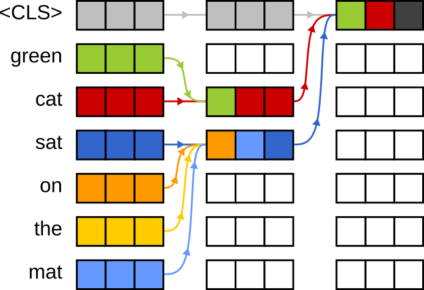
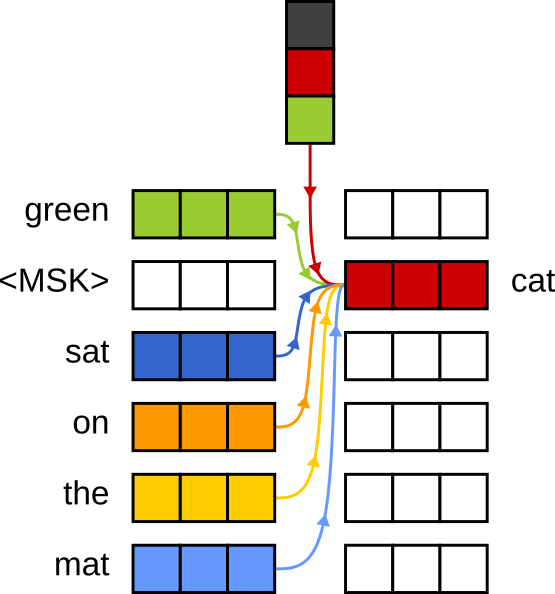
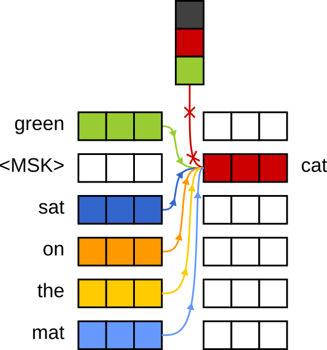

# CoTA: Compression Transformer Autoencoder

CoTA introduces a novel approach to representing sequential data. Instead of relying on a single
vector, CoTA utilizes a variable number of embedding vectors. This method enhances the preservation
of details and maintains the order more effectively.

|  |  |
|:---------------------------------------------------:|:-------------------------------------------------:|
|                   Typical encoder                   |                   CoTA encoder                    |

Unlike typical transformer encoders, the CoTA encoder selects which vectors to retain after applying
the attention mechanism. The model is trained to accurately reconstruct the sequence while
minimizing the number of embeddings.

|  |
|:-------------------------------------------:|

CoTA can be easily integrated into any Transformer encoder model without much effort. This method
doesn't require introducing any additional parameters. Instead, it uses the zero element of the
vectors after the attention mechanism to decide whether to keep or eliminate a vector. Vector
elimination can be implemented either by using an attention mask or by directly removing vectors
from the tensor.

|   |           |
|:------------------------------------------------:|:----------------------------------------------------------------------:|
| Decoder uses embedding to infer the masked token | Decoder has enough context to infer the masked token without embedding |

Originally, CoTA was trained for next-token prediction. Several research groups studying transformer
autoencoders have noted the issue of an overly powerful decoder, where the decoder can infer the
token without relying on the embedding. To mitigate this problem, we restricted the decoder's
visibility to just 5 tokens during training.

|  |  |  |
|:-----------------------------------------------------:|:-----------------------------------------------------:|:-----------------------------------------------------:|
