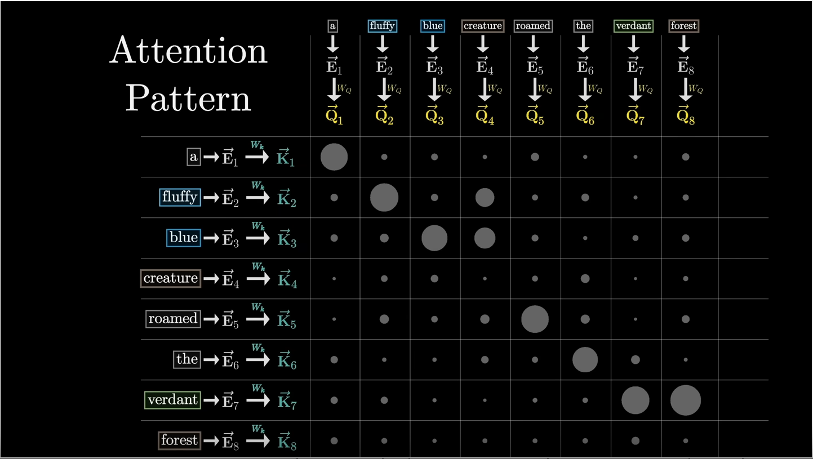
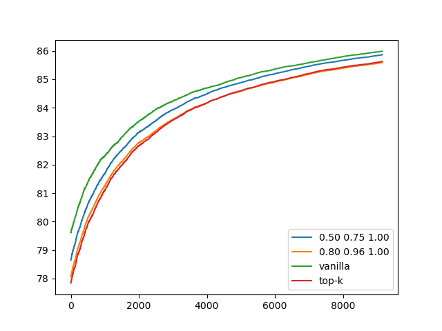
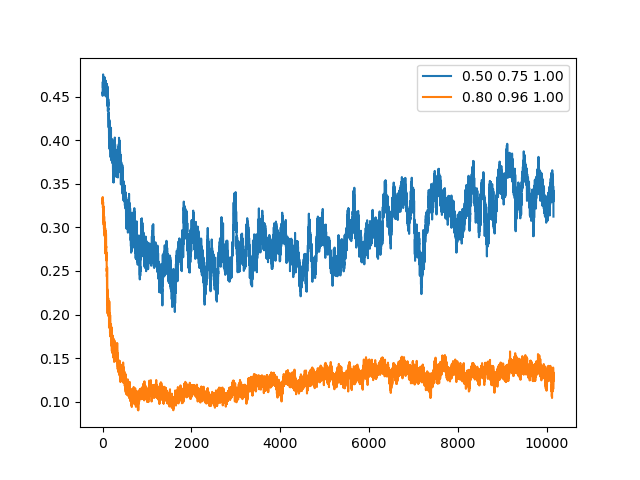

# Introduction

Attention is a powerful mechanism proposed by [Vaswani et al.](https://arxiv.org/abs/1706.03762) in 2017.
Core idea of the attention is to refine the representation of each individual word/token/patch in context.
This is done using the attention matrix, where each item indicates how one token is related to another.



In the example above taken from the great
visualisation [Attention in transformers by 3Blue1Brown](https://www.youtube.com/watch?v=eMlx5fFNoYc),
words "fluffy" and "blue" are significantly attending the word "creature".

# Idea

Calculating single attention matrix might be computationally intensive.
Moreover, modern architectures are repeating this step 8-24 times for a single pass.
Our initial idea was to optimize the attention by removing unused tokens.
Going back to the example above.
After the attention matrix calculation, the embeddings for each token will be refined using the corresponding weights:

```math
\vec{E}_{\text{creature}} = W_{\text{fluffy creature}} \times \vec{E}_{\text{fluffy}} + W_{\text{blue creature}} \times \vec{E}_{\text{blue}} +\:\ldots
```

The formula might vary from implementation to implementation.
The main idea that abstract representation of the word "creature" will represent "fluffy blue creature" after the
attention applied.
So, in theory, we do not really need words "fluffy" and "blue" anymore.
With this idea we started the experiments.

# Experiments

Not to complicate things we started with a simple criterion for token exclusion.
If we look at attention matrix, each row sums up to one:

|              | **fluffy** | **blue** | **creature** |         |
|:------------:|:----------:|:--------:|:------------:|:-------:|
|  **fluffy**  |    0.4     |   0.1    |     0.5      | **1.0** |
|   **blue**   |    0.1     |   0.3    |     0.6      | **1.0** |
| **creature** |    0.1     |   0.1    |     0.8      | **1.0** |

This is done intentionally, using Softmax function.
However, if we look at columns, we see a different situation:

|              | **fluffy** | **blue** | **creature** |
|:------------:|:----------:|:--------:|:------------:|
|  **fluffy**  |    0.4     |   0.1    |     0.5      |
|   **blue**   |    0.1     |   0.3    |     0.6      |
| **creature** |    0.1     |   0.1    |     0.8      |
|              |  **0.6**   | **0.4**  |   **1.9**    |

These weights are measuring how much the words are being updated.
Our initial criteria were:

- Threshold - allowing only tokens with corresponding score greater than some pre-fixed value to pass through
- Top-k - allowing only tokens with k-highest scores to pass

To test the assumptions, we started with binary classification task,
using [Yelp dataset](https://huggingface.co/datasets/Yelp/yelp_review_full).



Accuracy for different configurations is presented in diagram above.
Tested models are performing comparable to the vanilla attention mechanism,
while significantly compressing the initial sequence.
Compression ratios for two of the configurations are presented below:



# Disappointment

From the beginning we were worried, that someone already came up with some idea.
One day we finally found papers proposing similar idea for KV-cache optimization:
[Edoardo et al.](https://arxiv.org/abs/2410.13166),
[Zhenyu et al.](https://arxiv.org/pdf/2306.14048), and others.
Following the references from papers, we found the Pyramid-BERT by [Xin et al.](https://arxiv.org/pdf/2203.14380)
Which was a final nail in coffin for novelty of our paper.

# New hope

After a brainstorm, we came up with a new idea: implementing lossy compression for text.
While lossy compression algorithms are widely adopted for image and audio content,
alternatives for text were mostly studied in the end of 1990s.

We are going to adopt ideas proposed in KV-cache papers and Symbolic Auto-encoding by [Hossein et al.](https://arxiv.org/pdf/2402.10575),
to obtain a shorter sequence of tokens representing the core-meaning of initial sequence.
