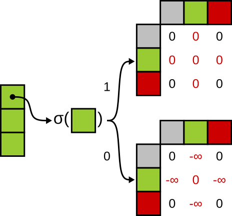

# CoTA: Compression Transformer Autoencoder

CoTA is a new way to represent sequential data.
Unlike the previous models, that used single vector to represent the sequential data,
CoTA uses varying number of embedding vectors.
This leads to a better preservation of details and order.

|  |  |
|:-----------------------------------------------------------------:|:-------------------------------------------------:|
|                     Usual transformer encoder                     |                   CoTA encoder                    |

Unlike usual transformer encoders, CoTA encoder decides which vectors to keep after applying attention mechanism.
The model has been trained to accurately reconstruct the sequence while keeping the number of embeddings small.

|  |
|:-------------------------------------------:|

CoTA can be adopted to any Transformer encoder model without significant effort.
This approach do not require any additional parameters to be introduced.
Zero element of the vectors after attention mechanism is used to determine whether to keep or eliminate the vector.
Vector elimination may be implemented either using attention mask or removing vectors from tensor.

|  |  |
|:-----------------------------------------------------------------:|:-------------------------------------------------------------------------------:|
|         Decoder uses embedding to infer the masked token          |     Decoder has enough context to infer the masked token without embedding      |

Originally CoTA has been trained for the next token prediction.
Several research groups studying transformer autoencoder has mentioned the problem of too strong decoder.
This the situation, when the decoder has enough information to infer the token without use of embedding.
To address this issue, we limited the decoder visibility to 5 tokens during the training.

|  |  |  |
|:-----------------------------------------------------:|:-----------------------------------------------------:|:-----------------------------------------------------:|
